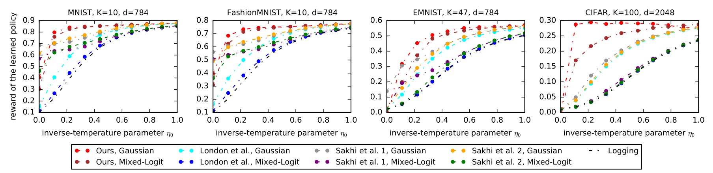

# [Exponential Smoothing for Off-Policy Learning (Oral at ICML 2023)](https://proceedings.mlr.press/v202/aouali23a/aouali23a.pdf)

Experiments for the paper [Exponential Smoothing for Off-Policy Learning](https://proceedings.mlr.press/v202/aouali23a/aouali23a.pdf) accepted for an __Oral presentation at ICML 2023__.

[Imad AOUALI](https://www.iaouali.com/) (Criteo and ENSAE-CREST), Victor-Emmanuel Brunel (ENSAE-CREST), David Rohde (Criteo), Anna Korba (ENSAE-CREST)

## Abstract

Off-policy learning (OPL) aims at finding improved policies from logged bandit data, often by minimizing the inverse propensity scoring (IPS) estimator of the risk. In this work, we investigate a smooth regularization for IPS, for which we derive a two-sided PAC-Bayes generalization bound. The bound is tractable, scalable, interpretable and provides learning certificates. In particular, it is also valid for standard IPS without making the assumption that the importance weights are bounded. We demonstrate the relevance of our approach and its favorable performance through a set of learning tasks. Since our bound holds for standard IPS, we are able to provide insight into when regularizing IPS is useful. Namely, we identify cases where regularization might not be needed. This goes against the belief that, in practice, clipped IPS often enjoys favorable performance than standard IPS in OPL.

## Repository Structure

This repository is structured as follows

- `Experiments.ipynb`
Notebook to run the main experiment of our paper.

- `Figures.ipynb`
Notebook to produce the main figure of our paper.

- `utils.py`
Useful Python functions.

- `policies.py`
The three types of policies that were used in our experiments, softmax, mixed-logit, and Gaussian.

- `models.py` 
The baselines used in our experiments.

- The folder `results` contains the results of models on different datasets saved as csv files.

- The folder `figures` contains the main figure of the paper, which is displayed above.

[imad-email]: mailto:imadaouali9@gmail.com 

## Acknowledgement
The code for the baselines was provided by Otmane Sakhi, Pierre Alquier, Nicolas Chopin, [PAC-Bayesian Offline Contextual Bandits With Guarantees](https://proceedings.mlr.press/v202/sakhi23a/sakhi23a.pdf). Many thanks to them.
